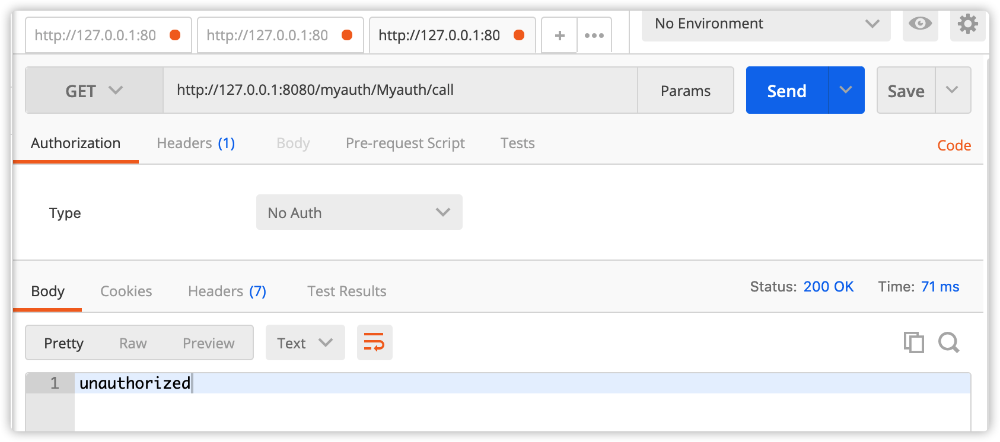
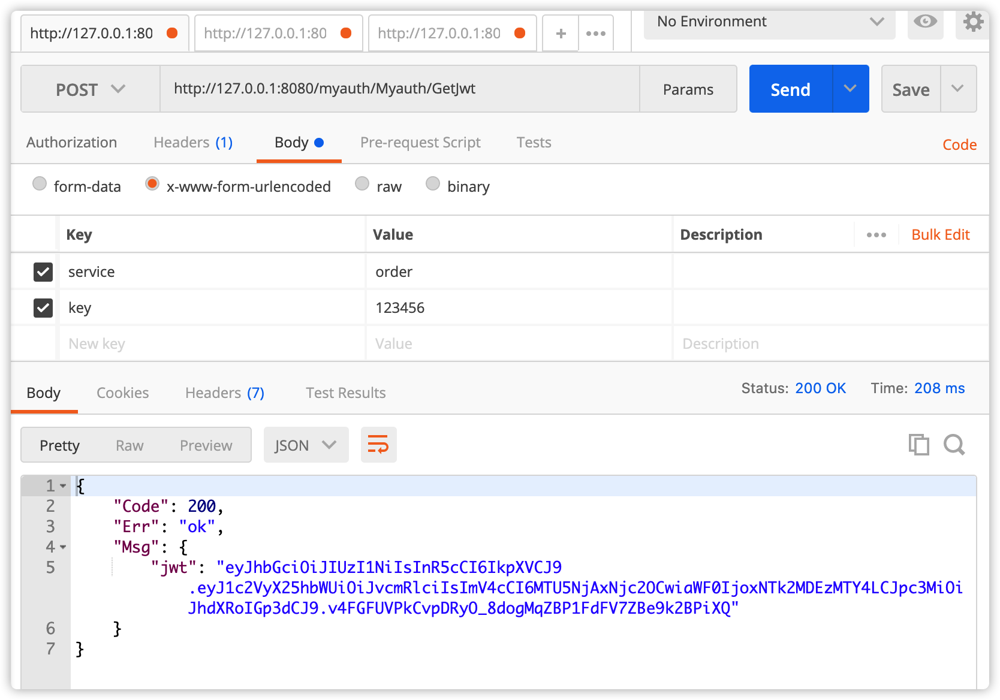
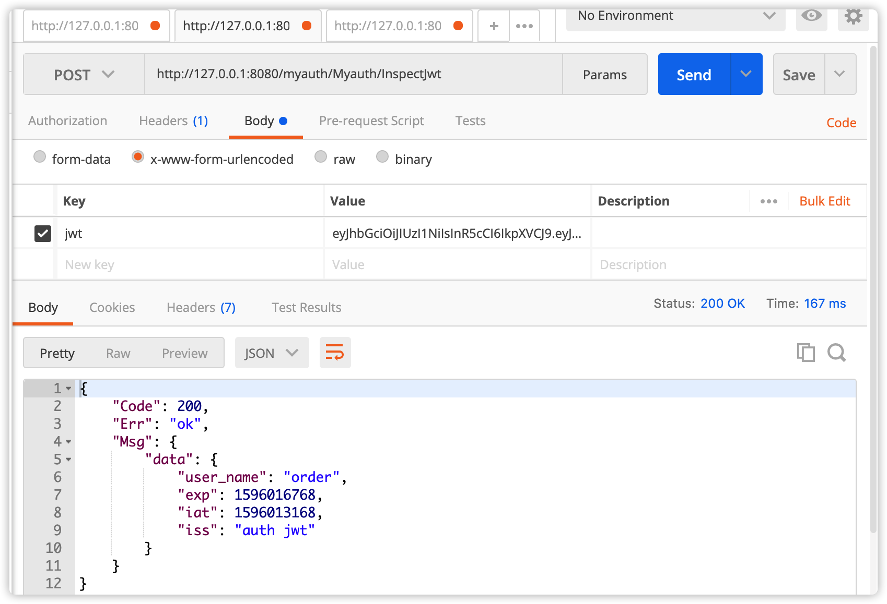
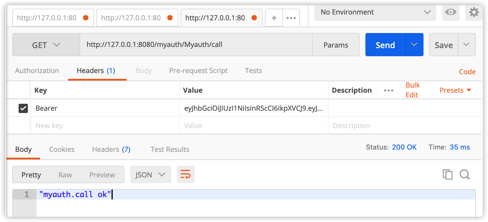

# micro jwt 网关鉴权

目标：
1. 内部服务间调用应在header上带上jwt token，否则返回错误提示信息
2. 有2种方式
    1. 在每个服务上各自鉴权
    2. 在网关上鉴权，各服务只需注册一个wrapper检查header中jwt信息鉴权。这样做有个前提，所有服务需放到同一个网络内，走统一的服务注册中心，这里主要介绍这种方式。
3. 先创建一个myauth的服务，对外提供2个接口
    1. GetJwt()     返回jwt token，可以用用户名密码或其他方式验证，根据具体业务灵活决定即可，这里示例采用服务名和密钥方式
    2. InspectJwt()  验证jwt token是否有效
4. 自定义一个网关，通过插件方式wrapper指定一个鉴权函数，除了第3步中的两个接口外，其他都需要header中有jwt的token
5. 其他业务只需要注册一个wrapper检查header中jwt信息鉴权
6. 业务调用步骤
    1. 调用GetJwt()获取jwt token
    2. 调用其他接口时，在header加入jwt token

 项目创建方式  
`micro new --type=api myauth`

启动  
go run main.go

启动网关  
go run ./gateway/main.go api --handler=api

测试  
直接调用Myauth/call，提示未授权
http://127.0.0.1:8080/myauth/Myauth/call

获取jwt token
http://127.0.0.1:8080/myauth/Myauth/GetJwt

验证jwt token,非必须，仅作示例
http://127.0.0.1:8080/myauth/Myauth/InspectJwt

header中带上jwt token访问Myauth/call，正常
http://127.0.0.1:8080/myauth/Myauth/call
